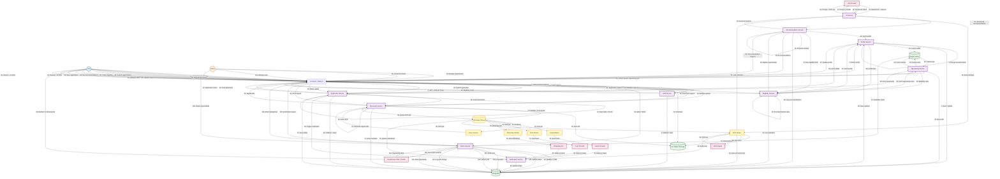

# Data Flow Diagram — GovEase AI

```mermaid
flowchart TD
    %% External Systems
    LLM[LLM Provider]
    OCR[OCR Engine]
    Email[Email Provider]
    Push[Push Provider]
    WA[WhatsApp API]
    GovAPI[Government APIs / Portals]
    S3[(S3 / Object Storage)]
    Redis[(Redis Cache)]
    DB[(MongoDB)]

    %% Users
    User((User))
    Admin((Admin))

    %% Frontend
    UI[Frontend - React.js]

    %% Backend Services
    Auth[Auth Service]
    Profile[Profile Service]
    Doc[Document Service]
    Opp[Opportunity Service]
    Elig[Eligibility Service]
    Rec[Recommendation Service]
    App[Application Service]
    Notif[Notification Service]
    AdminSvc[Admin Service]
    AISvc[AI Service]
    Queue[(Message Queue)]

    %% Async Workers
    Scanner[Virus Scanner]
    OCRWorker[OCR Worker]
    EmailWorker[Email Worker]
    PushWorker[Push Worker]
    WAWorker[WhatsApp Worker]

    %% Auth Flow
    User -->|1. Register / Login| UI
    UI -->|2. Auth request| Auth
    Auth -->|3. Validate / Hash| DB
    Auth -->|4. JWT + Refresh Token| UI
    UI -->|5. Authenticated requests| Auth

    %% Profile Flow
    User -->|6. Create / Update Profile| UI
    UI -->|7. Profile CRUD| Profile
    Profile -->|8. Encrypt sensitive fields| Profile
    Profile -->|9. Save / Update| DB
    Profile -->|10. Cache profile| Redis

    %% Document Flow
    User -->|11. Upload Document| UI
    UI -->|12. Multipart upload| Doc
    Doc -->|13. Validate / Scan queue| Queue
    Queue -->|14. Scan job| Scanner
    Scanner -->|15. Scan result| Doc
    Doc -->|16. Store file| S3
    Doc -->|17. Save metadata| DB

    User -->|18. Request document| UI
    UI -->|19. Document request| Doc
    Doc -->|20. Authorize| Doc
    Doc -->|21. Generate signed URL| Doc
    Doc -->|22. Signed URL| UI
    UI -->|23. Download| S3

    %% Opportunity Flow
    Admin -->|24. Manage opportunities| UI
    UI -->|25. Admin CRUD| AdminSvc
    AdminSvc -->|26. Validate + Audit| DB
    AdminSvc -->|27. Invalidate cache| Redis

    User -->|28. Search opportunities| UI
    UI -->|29. Search query| Opp
    Opp -->|30. Check cache| Redis
    Redis -->|31. Cache miss| Opp
    Opp -->|32. Query DB| DB
    Opp -->|33. Cache results| Redis
    Opp -->|34. Opportunity list| UI

    %% Eligibility Flow
    User -->|35. Check eligibility| UI
    UI -->|36. Eligibility request| Elig
    Elig -->|37. Fetch profile| Profile
    Profile -->|38. Profile data| Elig
    Elig -->|39. Fetch opportunity rules| Opp
    Opp -->|40. Eligibility rules| Elig
    Elig -->|41. Run deterministic rules| Elig
    Elig -->|42. Log evaluation| DB
    Elig -->|43. Eligibility result| UI

    %% Recommendation Flow
    User -->|44. Get recommendations| UI
    UI -->|45. Recommendation request| Rec
    Rec -->|46. Fetch profile| Profile
    Rec -->|47. Run eligibility filter| Elig
    Elig -->|48. Eligible opportunities| Rec
    Rec -->|49. Compute ranking| Rec
    Rec -->|50. Generate reasons| AISvc
    AISvc -->|51. Prompt + Profile| LLM
    LLM -->|52. Ranked list + reasons| AISvc
    AISvc -->|53. Structured recommendations| Rec
    Rec -->|54. Log recommendations| DB
    Rec -->|55. Recommendations| UI

    %% Application Flow
    User -->|56. Open application| UI
    UI -->|57. Application request| App
    App -->|58. Fetch opportunity| Opp
    App -->|59. Fetch profile| Profile
    App -->|60. Fetch documents| Doc
    App -->|61. Map fields + Pre-fill| App
    App -->|62. Draft application| UI
    User -->|63. Review + Confirm| UI
    UI -->|64. Submit application| App
    App -->|65. Validate + Save| DB
    App -->|66. Trigger notification| Notif
    App -->|67. Application status| UI

    User -->|68. Redirect to official portal| GovAPI
    User -->|69. Update status| UI
    UI -->|70. Status update| App
    App -->|71. Save status| DB

    %% Notification Flow
    Notif -->|72. Queue notifications| Queue
    Queue -->|73. Email job| EmailWorker
    Queue -->|74. Push job| PushWorker
    Queue -->|75. WhatsApp job| WAWorker
    EmailWorker -->|76. Send email| Email
    PushWorker -->|77. Send push| Push
    WAWorker -->|78. Send WhatsApp| WA
    Email -->|79. Delivery status| Notif
    Push -->|80. Delivery status| Notif
    WA -->|81. Delivery status| Notif
    Notif -->|82. Update status| DB

    %% OCR Flow
    User -->|83. Request OCR| UI
    UI -->|84. OCR request| Doc
    Doc -->|85. Queue OCR job| Queue
    Queue -->|86. OCR job| OCRWorker
    OCRWorker -->|87. Download document| S3
    OCRWorker -->|88. Run OCR| OCR
    OCR -->|89. OCR text| OCRWorker
    OCRWorker -->|90. LLM extraction| AISvc
    AISvc -->|91. Prompt + OCR text| LLM
    LLM -->|92. Structured JSON| AISvc
    AISvc -->|93. Extracted data| OCRWorker
    OCRWorker -->|94. Save extracted data| DB
    OCRWorker -->|95. Notify user| Notif
    User -->|96. Review + Confirm| UI
    UI -->|97. Update profile| Profile
    Profile -->|98. Save updates| DB

    %% Admin Operations
    Admin -->|99. Verify documents| UI
    UI -->|100. Verification request| AdminSvc
    AdminSvc -->|101. Update status| DB
    AdminSvc -->|102. Log action| DB
    AdminSvc -->|103. Notify user| Notif

    Admin -->|104. Manage rules| UI
    UI -->|105. Rule management| AdminSvc
    AdminSvc -->|106. Version rule| DB
    AdminSvc -->|107. Log rule change| DB

    %% External Integrations
    Admin -->|108. Import opportunities| AdminSvc
    AdminSvc -->|109. Fetch from external| GovAPI
    GovAPI -->|110. Opportunity data| AdminSvc
    AdminSvc -->|111. Store opportunity| DB

    %% Styling
    classDef user fill:#e1f5fe,stroke:#01579b,stroke-width:2px
    classDef admin fill:#fff3e0,stroke:#e65100,stroke-width:2px
    classDef service fill:#f3e5f5,stroke:#4a148c,stroke-width:2px
    classDef storage fill:#e8f5e9,stroke:#1b5e20,stroke-width:2px
    classDef external fill:#fce4ec,stroke:#880e4f,stroke-width:2px
    classDef queue fill:#fff9c4,stroke:#f57f17,stroke-width:2px

    class User user
    class Admin admin
    class Auth,Profile,Doc,Opp,Elig,Rec,App,Notif,AdminSvc,AISvc service
    class DB,Redis,S3 storage
    class LLM,OCR,Email,Push,WA,GovAPI external
    class Queue,Scanner,EmailWorker,PushWorker,WAWorker,OCRWorker queue
```
